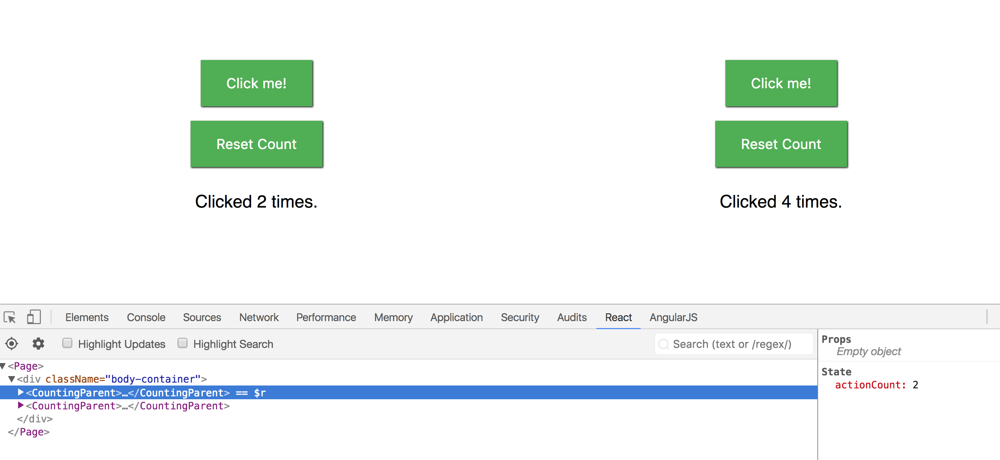
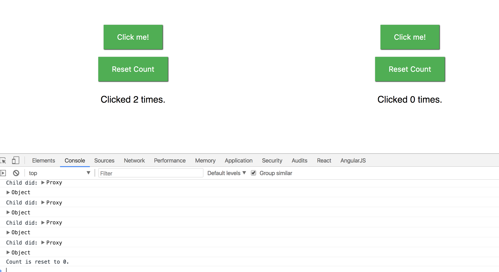
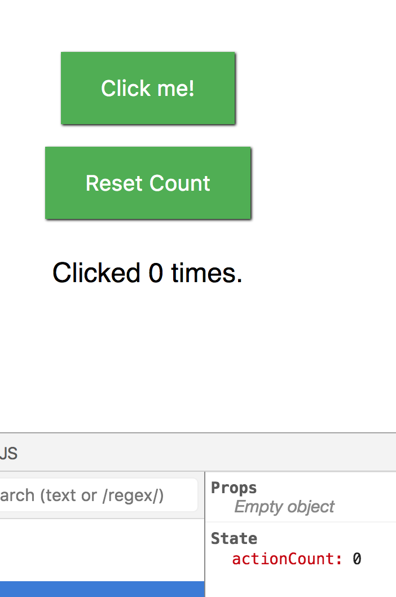
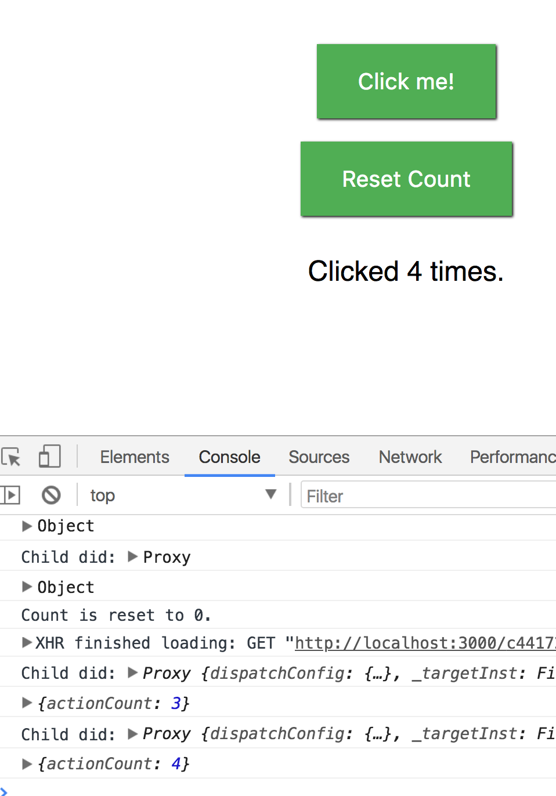

**Steve Hanlon May 5, 2018**

Assignment:
- Make a button that controls a count.  Have the count logged in a React state.  
- Also make a reset button that resets the count state back to zero.  
- Add a second button component to show that each state is only keeping state for its component (i.e. button on right can't control button on left's state).
- Use a functional setState to make sure the count in console.log matches the count state (i.e. the console.log should not be an old state always one count behind the actual state).

State count in lower right corner matches the number "Clicked 2 times" in the DOM.

After reset button is clicked, console shows a message "Count is reset to 0" and the right-side button shows "Clicked 0 times".

And actionCount state also shows the count 0.

Here's the functional setState now following the DOM count.  DOM count is at "Clicke 4 times" and the last console log is at {actionCount: 4}.

