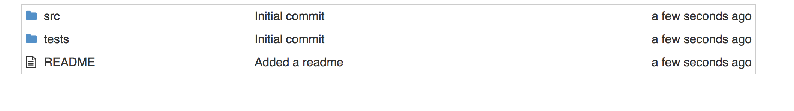
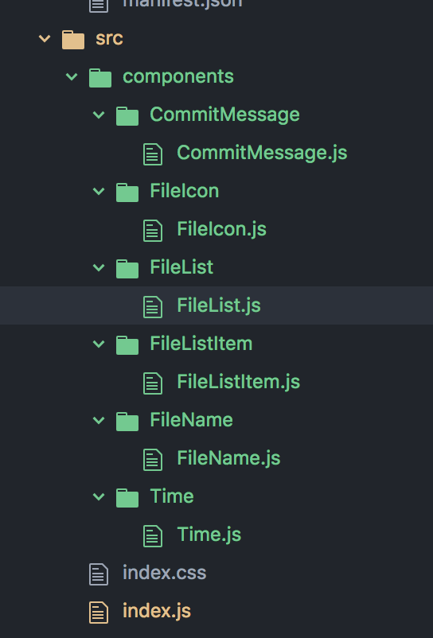

Pure React Assignment: Copy GitHub's layout with a multi-component React app that accepts an array of objects.  Use .map to distribute the objects to the components.  Break components into separate files, export and import as needed.
March 11, 2018 Steve Hanlon

###### Refactor the code from Exercise 1 to pull out components into separate files, using import and export.

