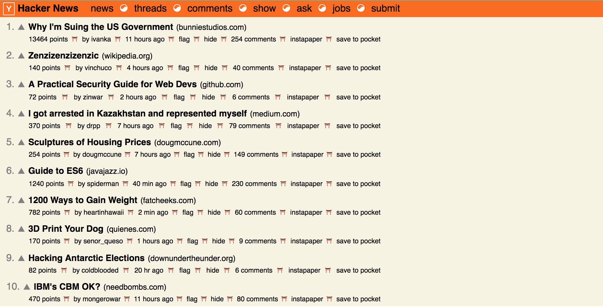

##### Pure React Assignment:
Render a row of HackerNews-like website of news articles

Created by Steve Hanlon April 2, 2018

##### Workflow:
- work out a HTML and CSS sample of single article post
- add HTML and CSS for Hacker Header
- Break into components
- Final CSS styling using FlexBox for layout
- add React .toArray for Nav and Footer children to add symbols between <li> elements
- add more objects to render more articles to DOM
