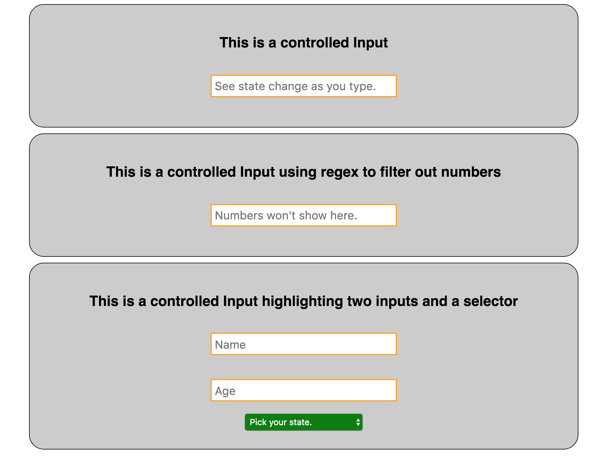
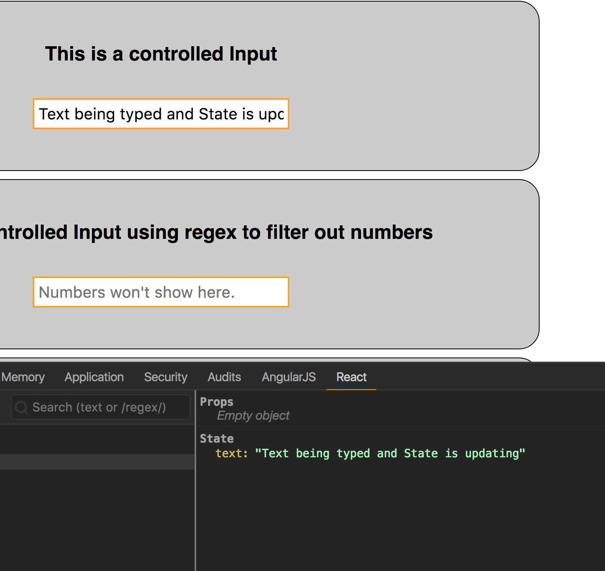
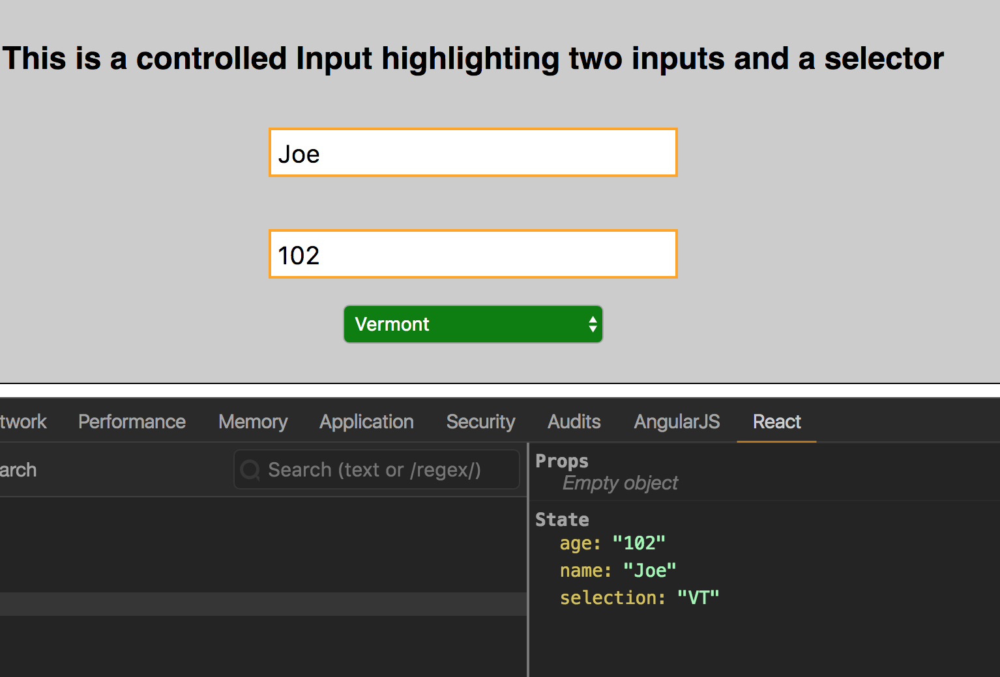

Steve Hanlon May 5, 2018

Assignment: Make “controlled” input components to control state. You
need to pass in a value, and keep that value updated as the user types.

- Make a controlled input, make sure State is updating as text is typed

- Make another Component with controlled input using regex to allow only letters to be inputted

- Make a component for a form Select with multiple options, also include two input fields. State Should auto update as inputs and Selector is used.

