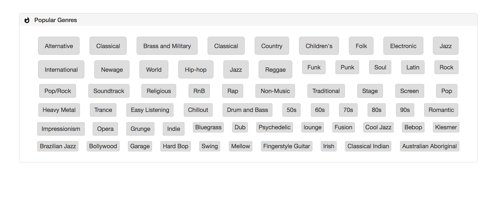

Assignment: Make an App that renders in the style of [InternetRadio](https://www.internet-radio.com/).

Created April 26, 2018 by Steve Hanlon

#### Workflow and observations
1. Create App component with static HTML adding just one genre button
- Create _genres_ array to serve as App input
- Add custom CSS Flexbox to get basic page layout and style, along with Bootstrap which will affect the rendered music genre buttons.
- Break App HTML into smaller components.
- Add .map to Stations component with conditional logic to decide which buttons will adjust in size according to Bootstraps classes.
- Pass that logic onto a child component called Styles.js to render an array of children or strings in the array.
- Final CSS adjustments
