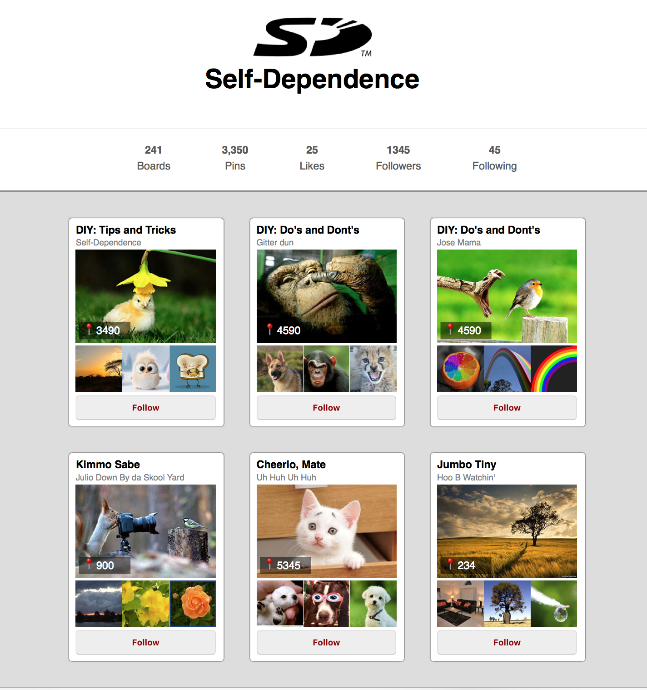

__Assignment__: Develop a React app that implements a list of image cards in the style of Pinterest.

_created by_: Steve Hanlon April 14th, 2018

#### Workflow
- use App.js to create HTML structure
- make input array with one object with image card info
- create App component to house static HTML
- Use CSS Grid and Flex for page layout
- Use CSS Grid for Board card layout
- Break App component into Account, Boards, Board, Nav components
  - Boards will use .map() to distribute an object elements of the array to <Board /> components
  - Board component will accept the object as input; use JSX to distribute object values to appropriate HTML elements
- Add 6 hard-coded objects to array
  - ** use require() function with image link as the argument so WebPack can render them to DOM properly.
- Final adjustments to CSS

(Note: logo from [wikimedia](https://commons.wikimedia.org/wiki/File:SD-Logo.svg) and all other images from net with non-commercial use license.  Used here just to fulfill the assignment**)

#### Future Improvements
- Make responsive layout for smaller screens
