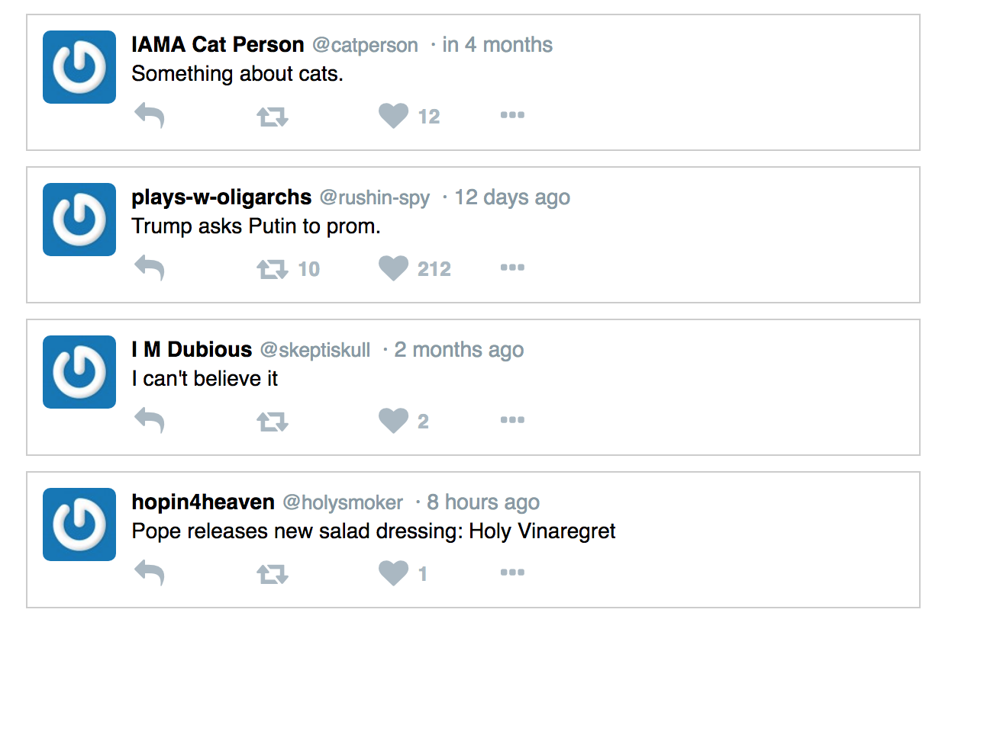

Pure React Tweet Assignment 1: Make a parent Tweet component which takes in several child components representing the parts of a Tweet. Hard-code only one Tweet.

Pure React Tweet Assignment 2: Reuse the Tweet component
from earlier and create a list of Tweets.

