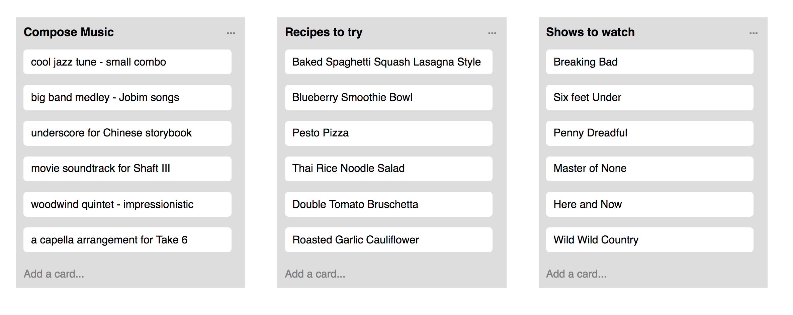

##### Pure React Assignment: 
Render a row of Trello-like cards side-by-side.

Created by Steve Hanlon March 26, 2018

##### Workflow:
- work out a rough HTML sample of Trello card
- Break Trello sample into components
- incorporate Flexbox and other styling
- add more objects to render more cards to DOM
